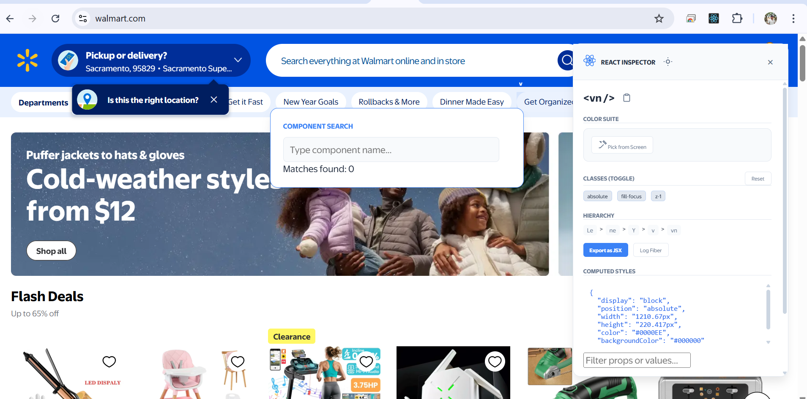

# ⚛️ React Inspector Pro


React Inspector Pro is a Chrome/Edge extension that inspects the live React Fiber tree directly on the page. It provides component inspection, JSX export, computed CSS exploration, and performance/a11y insights without switching away from the page.

Author: Sai Krishna Kanteti

---

**React Inspector Pro** is an **enterprise-grade Chrome / Edge extension** that provides a deep, **non-destructive inspection** of the React Fiber tree on any website.

Unlike standard React DevTools, this inspector **lives directly on the page**, offering **real-time audits, computed style exploration, and JSX code generation** without breaking application state.

---
A page-first React debugging tool that removes context switching and shows what the browser actually renders.
---

## 📦 Version

**v2.6.0**

---

## 👨‍💻 Author

**Sai Krishna Kanteti**

---

## 🚀 Key Features

### 🔍 Deep Fiber Inspection

* Inspect **Props**, **State**, and **Refs** by clicking any React element on the page
* Traverse the actual **React Fiber tree**, not a virtual abstraction

### 🧩 Export as JSX

* Generate a **ready-to-use JSX snippet** for the selected component
* Includes **current props and structure**

### 🎨 Computed CSS Explorer

* View **browser-calculated styles** (margin, padding, font-size, etc.)
* Compare **React metadata vs actual rendered CSS**

### 🔎 Component Search (`Alt + S`)

* Search for any React component globally
* Highlight **all instances** on the page
* Live match counter for quick navigation

### 🧠 Console Mapping

* Map any **Prop** or **State** object to global variables (`temp1`, `temp2`)
* Instantly debug from the **browser console**

### 🩺 Health & Accessibility Audit

* Detect **CSS bloat**
* Identify **missing `alt` attributes**
* Highlight **slow render performance bottlenecks**

### 🖥️ Interactive UI

* Draggable **side panel**
* **Dark / Light theme** support
* Preferences persist across sessions

---

## 🛠️ Installation (Developer Mode)

### 1️⃣ Clone the Repository

---

## Quick Install (Developer Mode)

1. Clone the repository:

```bash
git clone https://github.com/saikrishnaKrish/ReactInspectorTool.git
cd ReactInspectorTool
```

2. Open `chrome://extensions/` (or `edge://extensions/`).
3. Enable **Developer mode** (top-right).
4. Click **Load unpacked** and select the project folder (where `manifest.json` is located).
5. Open a React site and start inspecting.

---

## Usage & Shortcuts

| Shortcut | Action |
|---:|:---|
| Alt + I | Toggle Inspector (enable/disable hover highlights) |
| Alt + S | Component search (global finder & highlighter) |
| Alt + L | Layer mode (visualize component boundaries) |

---

## File Structure

- [manifest.json](manifest.json) — extension manifest (MV3)
- [inject.js](inject.js) — core inspector that runs in page context
- [content.js](content.js) — content script that injects `inject.js`
- icons/ — extension icons and branding assets
- README.md, LICENSE, CONTRIBUTING.md, etc.

---

## Development

1. Edit `inject.js` or `content.js` for feature work.
2. Reload the extension on `chrome://extensions/` and refresh the target page.
3. Use the `generate_icons.py` script to create PNG icons if needed (requires Python).

Optional helper scripts (see `package.json`):

```bash
npm run obfuscate   # obfuscate inject.js into dist/inject.obf.js (optional)
npm run assemble    # create dist_package/ for distribution
npm run pack        # create ZIP package (Windows PowerShell helper)
```

---

## Packaging & Distribution

- Use `npm run assemble` to build `dist_package/` containing `manifest.json`, `content.js`, `inject.js` (or `dist/inject.obf.js` if obfuscated), and `icons/`.
- Share the `dist_package/` folder or ZIP it and upload to the Chrome Web Store.
- For private distribution inside an organization, use enterprise deployment tools.

---

## Contributing

See [CONTRIBUTING.md](CONTRIBUTING.md) for contribution guidelines and development workflow.

---

## License

**React Inspector Pro** is licensed under the **MIT License**.

**Copyright © 2026 Sai Krishna Kanteti**

This project is open source and free to use, modify, and distribute under the terms of the MIT License. See [LICENSE](LICENSE) for full details.

### What You Can Do:
- ✅ Use commercially
- ✅ Modify the code
- ✅ Distribute copies
- ✅ Use privately

### What You Must Do:
- ✅ Include the license
- ✅ Provide attribution to the original author
- ✅ Include the copyright notice

---

## Author & Credits

**Original Author:** Sai Krishna Kanteti

**Repository:** https://github.com/saikrishnaKrish/ReactInspectorTool

---

# Initial version 
